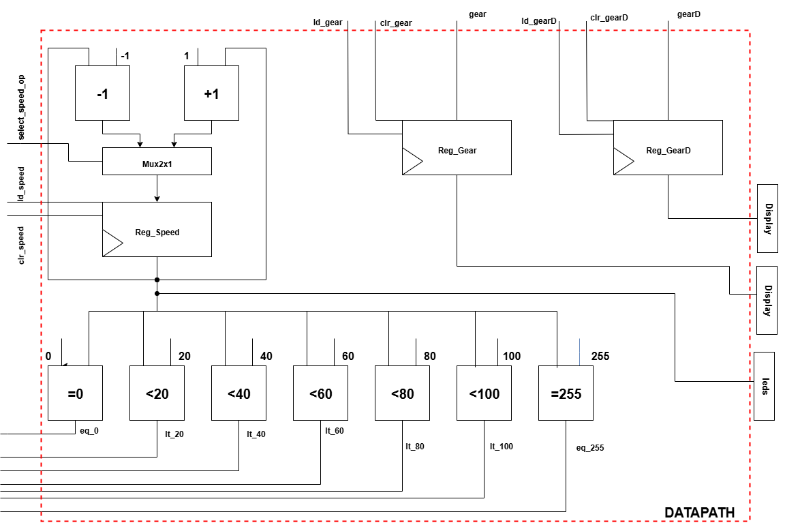

# Projeto Final: Sistema de Câmbio Automático em VHDL

Este projeto implementa um sistema de câmbio automático veicular utilizando VHDL. O sistema é composto por duas máquinas de estado principais que trabalham em conjunto para simular tanto a seleção de modo pela alavanca de câmbio quanto a troca automática de marchas com base na velocidade do veículo.

---

## ⚙️ Arquitetura e Funcionamento Geral

O sistema foi modelado como uma **Máquina de Estados de Alto Nível (HLSM)**, que é composta por uma Unidade de Controle (Controlador FSM) e uma Unidade de Operações (Datapath).

* **Unidade de Controle (FSM):** Gerencia as transições de estado, tanto para a alavanca (P, R, N, D) quanto para as marchas automáticas (1 a 6).
* **Datapath:** Executa as operações, como comparar a velocidade atual com as faixas predefinidas e armazenar o estado/marcha atual.

<b>Clique para ver os diagramas da arquitetura</b>

 

**Diagrama HLSM (Visão Geral):**

*Descrição: Diagrama de alto nível mostrando a interação entre o Datapath e a Unidade de Controle.*

**Diagrama do Datapath (Unidade de Operações):**

*Descrição: Detalhamento dos componentes do Datapath, como registradores, comparadores e multiplexadores.*

**Diagrama FSM do Controlador:**

*Descrição: Máquina de estados finitos que implementa a lógica de controle do câmbio.*

---

## 🚦 Lógica de Operação

O sistema possui dois comportamentos principais que são controlados pela FSM.

### 1. Seleção de Modo via Alavanca
O primeiro comportamento simula a alavanca de câmbio. A FSM gerencia os seguintes estados:
* **P (Park):** Veículo parado e travado.
* **R (Reverse):** Marcha à ré.
* **N (Neutral):** Ponto morto, motor desengatado.
* **D (Drive):** Modo de direção automática, que ativa a segunda FSM.

### 2. Troca de Marchas Automática (Modo Drive)
Quando o sistema está no estado **Drive (D)**, uma lógica secundária é ativada para trocar as 6 marchas com base em um valor de entrada que representa a velocidade do veículo.

As regras para a troca de marcha são:

| Faixa de Velocidade (km/h) | Marcha Engatada |
| :------------------------- | :-------------: |
| 0 - 20                     |       **1ª** |
| 21 - 40                    |       **2ª** |
| 41 - 60                    |       **3ª** |
| 61 - 80                    |       **4ª** |
| 81 - 100                   |       **5ª** |
| Acima de 100               |       **6ª** |

---

## 💡 Entradas e Saídas do Sistema (I/O)

* **Entradas Principais:**
    * `clk`: Sinal de clock global.
    * `reset`: Reinicia a máquina de estados para o estado inicial.
    * `select_gear [1:0]`: Vetor de 2 bits para selecionar o modo da alavanca (P, R, N, D).
    * `speed [7:0]`: Vetor de 8 bits representando a velocidade atual do veículo (0 a 255 km/h).

* **Saídas Principais:**
    * `display_gear [2:0]`: Saída para um display que mostra o modo atual (P, R, N, D).
    * `display_gearD [3:0]`: Saída para um display que mostra a marcha atual (1 a 6) quando em modo Drive.

---

## 🎥 Demonstração em Hardware (FPGA)

O vídeo abaixo demonstra o projeto final implementado e funcionando na placa FPGA. As entradas (velocidade e modo) são controladas através de chaves, e as saídas são exibidas nos displays de 7 segmentos da placa.

**[Link para o vídeo da demonstração no YouTube](URL_DO_SEU_VIDEO_AQUI)**

---

## 💻 Como Simular e Testar

1.  Abra o arquivo de projeto (`.qpf`) no **Intel Quartus Prime**.
2.  Compile o projeto para garantir que não há erros de sintaxe.
3.  Inicie uma nova simulação no **ModelSim** ou use a ferramenta de simulação de formas de onda do Quartus.
4.  No simulador, aplique valores aos sinais de entrada `select_gear` e `speed` ao longo do tempo.
5.  Observe as saídas `display_gear` e `display_gearD` para verificar se as transições de estado e as trocas de marcha ocorrem conforme o esperado.

## Autores

- Hudson Ramon
- Luiz Felipe
- Luciano Medeiros
