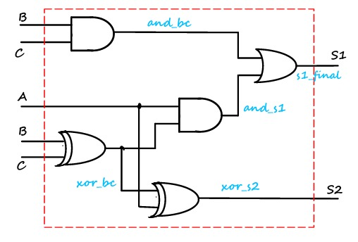

# Prática 1 - Circuitos Digitais

**Projeto:** Circuito Contador de 1's (uns)  
**Disciplina:** Sistemas Digitais - Prática (DCA3303.1)  
**Alunos:**  
- Ana Beatriz Maia Morais  
- Karolina Pereira de Souza  
- Luiz Felipe de Souza Silva  
- Thamirys Carollina Barbosa de Barros  

---

## Objetivos do Circuito

- Projetar um circuito que, a partir das entradas A, B e C, indique nas saídas S1 e S2 a quantidade de bits ‘1’ presentes.  
- Montar a tabela verdade, simplificar as equações booleanas, desenhar o circuito lógico, implementar em VHDL, simular no Quartus e mapear na FPGA.  

---

## Tabela Verdade

| A | B | C | S1 | S2 |
|---|---|---|----|----|
| 0 | 0 | 0 | 0  | 0  |
| 0 | 0 | 1 | 0  | 1  |
| 0 | 1 | 0 | 0  | 1  |
| 0 | 1 | 1 | 1  | 0  |
| 1 | 0 | 0 | 0  | 1  |
| 1 | 0 | 1 | 1  | 0  |
| 1 | 1 | 0 | 1  | 0  |
| 1 | 1 | 1 | 1  | 1  |

---

## Equações Simplificadas

- **S1** = BC + A(B ⊕ C)  
- **S2** = A ⊕ B ⊕ C  

*(⊕ representa a operação XOR)*  

---

## Circuito em Portas Lógicas

  

> **Nota:** Os sinais em azul são fios auxiliares que facilitam a criação do circuito em VHDL e devem ser mapeados na implementação.  

---

## Códigos em VHDL

- [Porta AND](https://github.com/luiz-pytech/Praticas_Sistemas_Digitais/pratica1_contador_de_uns/PortaAnd.vhdl)  
- [Porta OR](https://github.com/luiz-pytech/Praticas_Sistemas_Digitais/pratica1_contador_de_uns/PortaOr.vhdl)  
- [Porta XOR](https://github.com/luiz-pytech/Praticas_Sistemas_Digitais/pratica1_contador_de_uns/PortaXor.vhdl)  
- [Contador de Bits](https://github.com/luiz-pytech/Praticas_Sistemas_Digitais/pratica1_contador_de_uns/bitsContador.vhdl)  

---

## Simulação

- As simulações foram realizadas utilizando o **Quartus** e o **ModelSim**.  
- Foram testadas todas as combinações possíveis das entradas A, B e C, verificando a correta ativação dos LEDs correspondentes às saídas S1 e S2.  

---

## Sobre a Placa Utilizada

- Placa: **DE2 da Altera**, modelo **Cyclone II 2C35 FPGA**  

### Sugestão de mapeamentos para este modelo de placa:  

| Entrada/Saída | Pino   | FPGA        |
|---------------|--------|-------------|
| Entrada A     | PIN_N25 | SWITCH[0]  |
| Entrada B     | PIN_N26 | SWITCH[1]  |
| Entrada C     | PIN_P25 | SWITCH[2]  |
| Saída S1      | PIN_AE23 | LEDR[0]   |
| Saída S2      | PIN_AF23 | LEDR[1]   |

---

