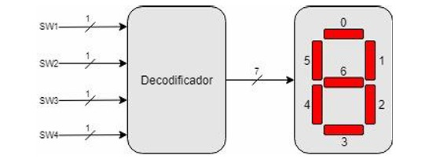

# 📁 Decodificador BCD para 7 Segmentos em VHDL

## 📜 Descrição do Repositório
Este repositório contém as implementações em VHDL de um decodificador BCD para display de 7 segmentos, desenvolvido para o Laboratório 2 de Circuitos Digitais. Um **Decodificador BCD-7 segmentos** é um circuito combinacional que converte um código binário (BCD) em sinais para acionar os segmentos de um display numérico, permitindo a visualização de dígitos decimais (0-9).

---
## A implementação:

  

## 📋 Descrição das Questões

### 🔹 **Questão 2a: Tabela Verdade do Decodificador**
- **Descrição**: Tabela verdade completa para o decodificador BCD-7 segmentos, onde:
  - `'1'` = segmento apagado
  - `'0'` = segmento aceso
- **Código**: [Ver tabela verdade](#) *(https://docs.google.com/spreadsheets/d/1Vll9U8piSXIK5Il_dozpinriht3iuATntEbzL4hQ7GE/edit?usp=sharing)*

| **A4** | **A3** | **A2** | **A1** | **S6** | **S5** | **S4** | **S3** | **S2** | **S1** | **S0** | **VALOR ATUALIZADO** |
|---|---|---|---|---|---|---|---|---|---|---|---|
| 0 | 0 | 0 | 0 | 1 | 0 | 0 | 0 | 0 | 0 | 0 | 0 |
| 0 | 0 | 0 | 1 | 1 | 1 | 1 | 1 | 0 | 0 | 1 | 1 |
| 0 | 0 | 1 | 0 | 0 | 1 | 0 | 0 | 1 | 0 | 0 | 2 |
| 0 | 0 | 1 | 1 | 0 | 1 | 1 | 0 | 0 | 0 | 0 | 3 |
| 0 | 1 | 0 | 0 | 0 | 0 | 1 | 1 | 0 | 0 | 1 | 4 |
| 0 | 1 | 0 | 1 | 0 | 0 | 1 | 0 | 0 | 1 | 0 | 5 |
| 0 | 1 | 1 | 0 | 0 | 0 | 0 | 0 | 0 | 1 | 0 | 6 |
| 0 | 1 | 1 | 1 | 1 | 1 | 1 | 1 | 0 | 0 | 0 | 7 |
| 1 | 0 | 0 | 0 | 0 | 0 | 0 | 0 | 0 | 0 | 0 | 8 |
| 1 | 0 | 0 | 1 | 0 | 0 | 1 | 0 | 0 | 0 | 0 | 9 |
| 1 | 0 | 1 | 0 | 1 | 1 | 1 | 1 | 1 | 1 | 1 | leds apagados |
| 1 | 0 | 1 | 1 | 1 | 1 | 1 | 1 | 1 | 1 | 1 | leds apagados |
| 1 | 1 | 0 | 0 | 1 | 1 | 1 | 1 | 1 | 1 | 1 | leds apagados |
| 1 | 1 | 0 | 1 | 1 | 1 | 1 | 1 | 1 | 1 | 1 | leds apagados |
| 1 | 1 | 1 | 0 | 1 | 1 | 1 | 1 | 1 | 1 | 1 | leds apagados |
| 1 | 1 | 1 | 1 | 1 | 1 | 1 | 1 | 1 | 1 | 1 | leds apagados |

---

### 🔹 **Questão 2b: Decodificador com Portas Lógicas**
- **Descrição**: Implementação usando portas lógicas (`AND`, `OR`, `NOT`) para cada segmento (0-7).  
- **Código**: [`Decodificador BCD - Portas Lógicas`](https://github.com/luiz-pytech/Praticas_Sistemas_Digitais/blob/main/pratica2-Multiplexadores_Decodificadores/Decodificadores/bcd7seg_gate_level.vhd)  

### 🔹 **Questão 2c: Decodificador Comportamental**
- **Descrição**: Implementação usando a abordagem comportamental (`when-else`) para cada segmento (0-7).  
- **Código**: [`Decodificador BCD - Comportamental`](https://github.com/luiz-pytech/Praticas_Sistemas_Digitais/blob/main/pratica2-Multiplexadores_Decodificadores/Decodificadores/bcd7seg_gate_level.vhd)

### 🔹 **Questão 2d: Outros casos garantir que o LED esteja desligado**
- **Descrição**: Os casos onde o led é desligado fora de 0-9 foram previstos nos códigos.  

### 🔹 **Questão 2e: Implementação e Síntese da placa**
- **Descrição**: Simulação e Síntese na FPGA.  

# Equações (CAPTURA DO COMPORTAMENTO)

- Como esse decodificador acende em sinal baixo '0' é necessário que após a captura negar toda a equação.
- As equações abaixo devem ser negadas nessa na implementação.

## Equações

```plaintext
Completa: s0 = A4'A3'A2'A1' + A4'A3'A2A1' + A4'A3'A2A1 + A4'A3A2'A1 + A4'A3A2A1' + A4'A3A2A1 + A4A3'A2'A1' + A4A3'A2'A1
Simplificacao: s0 = A4'A3'A1' + A4'A3A1 + A4A3'A2' + A4'A3'A2A1 + A4'A3A2A1'

Completa: s1 = A4'A3'A2'A1' + A4'A3'A2'A1 + A4'A3'A2A1' + A4'A3'A2A1 + A4'A3A2'A1' + A4'A3A2A1 + A4A3'A2'A1' + A4A3'A2'A1
Simplificacao: s1 = A4'A3'A2' + A4'A3'A2 + A4A3'A2' + A4'A3A2'A1' + A4'A3A2A1

Completa: s2 = A4'A3'A2'A1' + A4'A3'A2'A1 + A4'A3'A2A1 + A4'A3A2'A1' + A4'A3A2'A1 + A4'A3A2A1' + A4'A3A2A1 + A4A3'A2'A1' + A4A3'A2'A1
Simplificacao: s2 = A4'A3'A2' + A4'A3A2' + A4'A3A2 + A4A3'A2' + A4'A3'A2A1

Completa: s3 = A4'A3'A2'A1' + A4'A3'A2A1' + A4'A3'A2A1 + A4'A3A2'A1 + A4'A3A2A1' + A4A3'A2'A1' + A4A3'A2'A1
Simplificacao: s3 = A4'A3'A1' + A4'A3'A2A1 + A4'A3A2'A1 + A4'A3A2A1' + A4A3'A2'A1' + A4A3'A2'A1

Completa: s4 = A4'A3'A2'A1' + A4'A3'A2A1' + A4'A3A2A1' + A4A3'A2'A1'
Simplificacao: s4 = A4'A3'A1' + A4'A3A2A1' + A4A3'A2'A1'

Completa: s5 = A4'A3'A2'A1' + A4'A3A2'A1' + A4'A3A2'A1 + A4'A3A2A1' + A4A3'A2'A1' + A4A3'A2'A1
Simplificacao: s5 = A4'A2'A1' + A4'A2'A1 + A4'A3A2A1' + A4A3'A2'A1'

Completa: s6 = A4'A3'A2A1' + A4'A3'A2A1 + A4'A3A2'A1' + A4'A3A2'A1 + A4'A3A2A1' + A4A3'A2'A1' + A4A3'A2'A1
Simplificacao: s6 = A4'A3A2' + A4A3'A2' + A4'A3'A2 + A4'A3A2A1'

```
---


