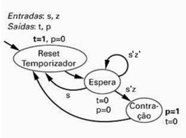

# Prática 3 - Pacemaker

**Projeto:** Pacemaker  
**Disciplina:** Sistemas Digitais - Prática (DCA3303.1)  
**Alunos:**  
- Ana Beatriz Maia Morais  
- Karolina Pereira de Souza  
- Luiz Felipe de Souza Silva  
- Thamirys Carollina Barbosa de Barros  

---

## Objetivos do Circuito

- Projetar um marca-passo simples em VHDL  
- Descrever o marca-passo em portas lógicas e comportamental  

---

## Tabela Verdade

| Estado Atual | s | z | s1 | s0 | t | p | n1 | n0 |
|--------------|---|---|----|----|---|---|----|----|
| **Reset Temporizador (00)** |||||||||
|              | 0 | 0 | 0  | 0  | 1 | 0 | 0  | 1  |
|              | 0 | 1 | 0  | 0  | 1 | 0 | 1  | 0  |
|              | 1 | 0 | 0  | 0  | 1 | 0 | 1  | 1  |
|              | 1 | 1 | 0  | 0  | 1 | 0 | 1  | 1  |
| **Espera (01)** |||||||||
|              | 0 | 0 | 0  | 1  | 0 | 0 | 0  | 1  |
|              | 0 | 1 | 1  | 0  | 0 | 1 | 0  | 0  |
|              | 1 | 0 | 1  | 0  | 0 | 1 | 0  | 0  |
|              | 1 | 1 | 1  | 0  | 0 | 1 | 0  | 0  |
| **Contração (10)** |||||||||
|              | 0 | 0 | 0  | 0  | 0 | 1 | 0  | 0  |
|              | 0 | 1 | 0  | 0  | 0 | 1 | 0  | 0  |
|              | 1 | 0 | 0  | 0  | 0 | 1 | 0  | 0  |
|              | 1 | 1 | 0  | 0  | 0 | 1 | 0  | 0  |

---

**Equações Lógicas:**

`t = s1'·s0'·(s'z' + s'z + sz' + sz)`  
`t = s1'·s0'·s' + s1'·s0'·s`\
`t = s1's0'`

`p = s1·s0'·(s'z' + s'z + sz' + sz)`  
`p = s1·s0'·s' + s1·s0'·s` \
`p = s1s0'`

`n1 = s'·z·s1·s0`  

`n0 = s1'·s0'·s' + s1'·s0'·s + s1'·s0·s'·z'`

---

## FSM DE IMPLEMENTAÇÃO

  

---

## Simulação

- As simulações foram realizadas utilizando o **Quartus** e o **ModelSim**.  
- Nesse programa não teve gravação na placa, apenas simulação.  

---

